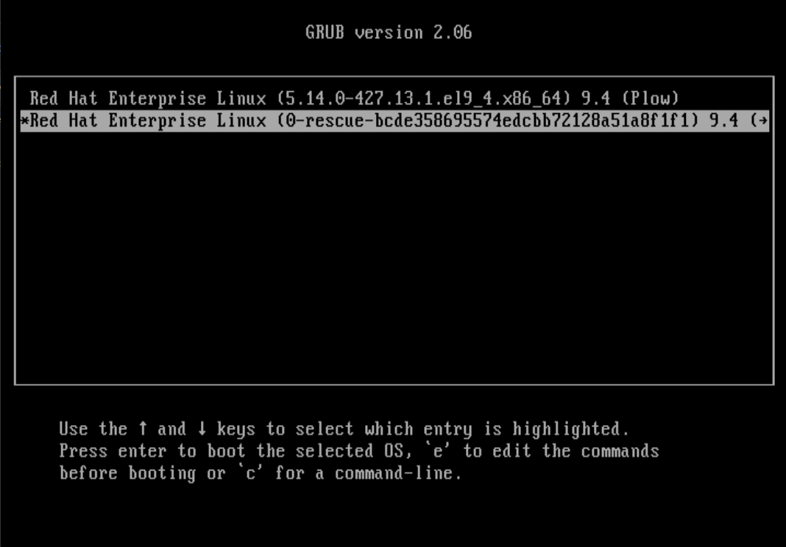

# RedHat

### Recovery ROOT password
In the inicialization of the system press TAB and edit using "e".
insert "rd.break" in the end of the line (linux...... quiet rd.break), save with "CTRL+X".
wait the system boot up
check if /sysroot is "RO" using the command below:
```bash
mount
```
Change to "RW" with:
```bash
mount -o remount,rw /sysroot
```
Gain access to /sysroot with:
```bash
chroot /sysroot
```
you should gain access to bash now.
use command "passwd root" to change the root password of the root user.

DON'T EXIT YEAT.
create file with command: 
```bash
touch /.autorelabel
```
type "exit" twice to finish the process,
now the system will reboot.
congrats your password has been reset successfully.



---

# User managment

### Path for users:

```
/etc/passwd
```

### Understading passwd file:

USERS: /etc/passwd
```
root:x:0:0:root:/root:/bin/bash
  ^  ^ ^ ^  ^     ^     ^ 
  |  | | |  |     |     |
  |  | | |  |     |     |____ ACCESS
  |  | | |  |     |_________________ USER HOME DIRECTORY  
  |  | | |  |____________________________ COMMENT (CAN BE ANYTHING) - JUST A COMMENT
  |  | | |______________________________________ GROUP ID
  |  | |_________________________________________________ USER ID
  |  |__________________________________________________________ PASSWORD IS STORED LOCAL
  |________________________________________________________________________ USER NAME
  ```

ID 0 to 999 is for system users
The first user in the system starts with 1000

Type of users:
- Commun user
- System user
- Administrator user

GROUPS: /etc/group
```
root:x:0:root
^    ^ ^ ^     
|    | | |   
|    | | |        
|    | | |    
|    | | |  
|    | | |_____ MEMBERS OF THE GROUP
|    | |____________________________ GROUP ID
|    |______________________________________  GROUP PASSWORD (DEPRECATED)
|________________________________________________________________________ GROUP NAME
  ```

### Manager user logins

```bash
/etc/login.defs
```

### To add user:

```bash
useradd new-user-here
```

### To modify user:

```
usermod user-name-here
```

### To del user:

```bash
userdel user-name-here
```

### To add group:

```bash
groupadd new-group-name-here
```

### To modify group:

```
groupmod group-name-here
```

### To del group:

```bash
groupdel group-name-here
```

### Get user info:

```bash
id user-name-here
```

### Change user:

```bash
su user-name-here
```

### Scalate privilagies:

```bash
sudo
```

### Change user password:

```bash
passwd user-name-here
```

### User account policies (Expiration, Block, Date):

```bash
chage
```

### Change group password:

```bash
gpasswd
```

---
### Root login Cockpit
Root login is not enabled by default
if you want to allow root login, comment or remove root user in: /etc/cockpit/disallowed-users

### Enable Cockpit service

```bash
sudo systemctl start cockpit.service
```

### Enable root SSH login
By default root ssho login is disabled
To enable, set "PermitRootLogin yes" in: etc/ssh/sshd_config
After that restart the service:
```bash
systemctl restart sshd.service
```

### Enable cockpit in boot
```bash
systemctl enable cockpit.socket
```

### Register your RHEL

```bash
subscription-manager register
```

### List REPOS enabled on Subscription

```bash
subscription-manager repos --list-enabled
```

### List available subscription

```bash
subscription-manager --available
```

### List Repositories

```bash
yum repolist
```

OR
```bash
subscription-manager repos --list
```

### To list REPO

```bash
subscription-manager repos --list
```

### To Enable REPO

```bash
subscription-manager repos --enable=rhel-9-for-x86_64-baseos-rpms 
```

### To Disable REPO

```bash
subscription-manager repos --disable=rhel-9-for-x86_64-appstream-rpms
```

### Default Repo Path:

```
/etc/yum.repos.d
```

### To create REPO

```
[atomycloud]
name= Atomy Cloud
baseurl=file://repo/BaseOS
enabled= 1
gpgcheck= 0
```

### Get info about package

yum info PACKAGE-NAME
Examples: 
```bash
yum info httpd
```

### Discovery package provider

yum provides "PACKAGE-NAME"

Examples: 
```bash
yum provides ping
```

### List Package Group

```bash
yum group list
```

### To Install Package Group

yum groupinstall "Package-Group-Name"

Example:
```bash
yum groupinstall "Development Tools"
```

### To Remove Package Group

yum group remove "Package-Group-Name"

Example:
```bash
yum group remove "Development Tools"
```

### To list all services

```bash
systemctl list-unit-files
```

### Change GUI to CLI default

```bash
systemctl isolate multi-user.target
```

### Change CLI to GUI default

```bash
systemctl isolate graphical.target
```

### To put system in Recue mode

```bash
systemctl isolate rescue.target
```

### See History of YUM

```bash
yum history
```

### Retrieve info about package group

```bash
yum history info ID
```

### UNDO Package group

```bash
yum history undo ID
```

### To Disable Firewall
```bash
systemctl stop firewall.service
setenforce 0
getenforce
```

### To list all services

```bash
systemctl list-unit-files
```

### To set new hostname

hostnamectl set-hostname NAME_HERE

Example:
```bash
hostnamectl set-hostname yourdomain.com
```

### Hostname path name

```bash
/etc/hostname
```
